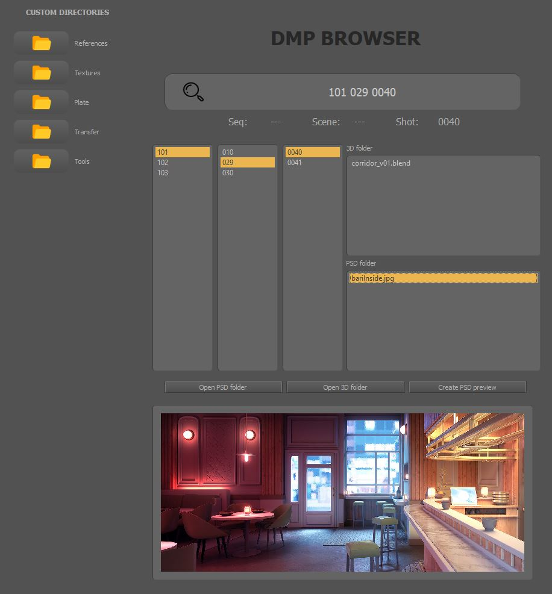
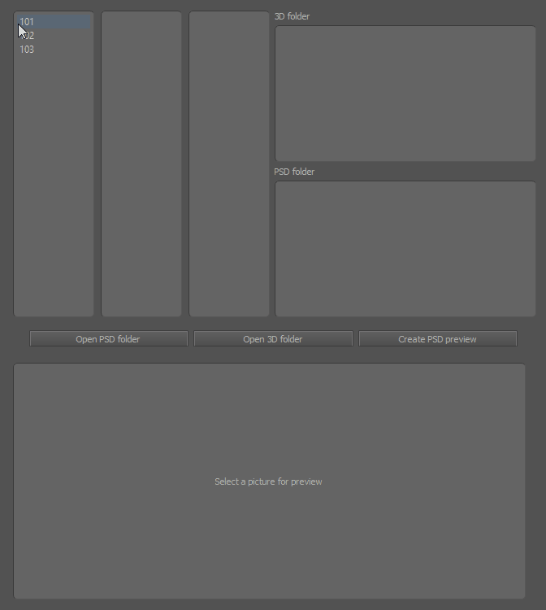
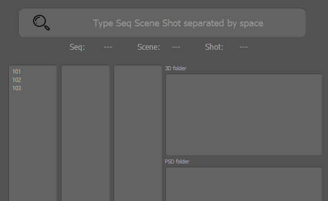
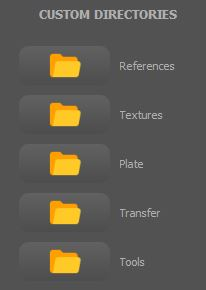

# Quick start

<table>
<tr>
<td>

The tool is designed to spend less time when browsing through nested folder structure and quickly preview the pictures of a shot.

</td>
</tr>
</table>

# Features
- Browse through directory tree
- Type a shot to access it directly
- When typing a new shot, it'll create it using predefined folder structure
- Preview 3D folder content and PSD folder. CLick to preview picture
- PSD preview create JPG from each PSD / PSB
- Double click to open 3D file or PSD file
- List of favorite folders.


<p style="text-align:center;"></p>


## Folder structure
Here is the current folder structure:

* Seq
    - Scene
      - Shot
        - 3D
        - PSD
        - REF


Adjust the root project path.
<!-- Code -->
```python 
# CUSTOM DIRECTORY
ROOT_PATH = Path(r"C:\TMP_local\Project")
```


## Browse folders
You can browse in the directory tree or you can directly type the desired shot.

If the shot doesn't exist, it'll create the shot using predifined folder structure.
Click on file for image preview, or double click to open.
<p style="text-align:center;"></p>

When typing the shot, you need to respect the format:
"seq scene shot" each separated by a space.
No need to type the zero as it'll autofill to fit the format.

<p style="text-align:center;">Seq: 3 digits / Scene: 3 digits / Shot: 4 digits</p>
<p style="text-align:center;">"--- --- ----"</p>

<p style="text-align:center;"></p>


# Custom directories 
Link to favorite folders.

You can add your own folder in the Custom list by amending this dictionary.
<p style="text-align:center;"></p>


<!-- Code -->
```python 
# CUSTOM DIRECTORY
self.dir_special = {
    "References": Path(r"C:\_YannB\_WORK\11_UNTOLD\_REF"),
    "Textures": Path(r"C:\_YannB\_WORK\11_UNTOLD\_TRANSFER"),
}
```

# Template structure

Edit your template for new shot.
<!-- Code -->
```python 
    def create_template_folder(self):
        """
        Template for new shot
        """
        self.shot_dir.joinpath("3D/scenes").mkdir(parents=True, exist_ok=True)
        self.shot_dir.joinpath("3D/data").mkdir(parents=True, exist_ok=True)
        self.shot_dir.joinpath("3D/textures").mkdir(parents=True, exist_ok=True)
        self.shot_dir.joinpath("3D/assets").mkdir(parents=True, exist_ok=True)
        self.shot_dir.joinpath("3D/imagePlane").mkdir(parents=True, exist_ok=True)
        self.shot_dir.joinpath("PSD").mkdir(parents=True, exist_ok=True)
        self.shot_dir.joinpath("REF").mkdir(parents=True, exist_ok=True)
```

Here is the current template structure:

* 3D
    - assets
    - data
    - imagePlane
    - scenes
    - textures    


# Installation

Install all depedencies using pip

```bash
  pip install -r requirements.txt
```


